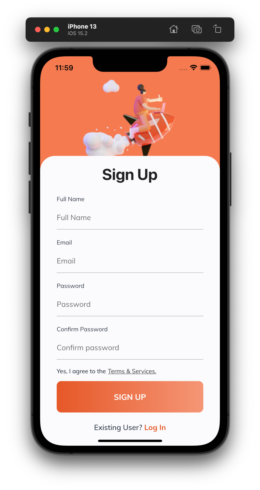
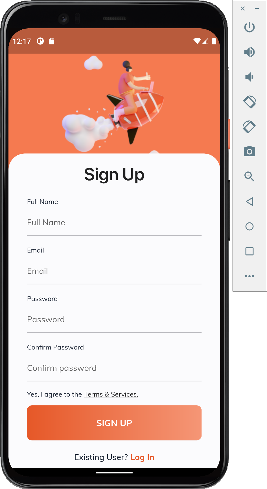

# Flutter E-commerce App

## About

Ứng dụng e-commerce đơn giản được tạo ra trong quá trình học flutter của tôi. Không có backend riêng, chỉ sử dụng firebase.

## Feature
- [x] Đăng kí tài khoản, đăng nhập, đăng xuất, thay đổi password.
- [x] Thêm, xoá sản phẩm khỏi danh sách sản phẩm yêu thích.
- [x] Các chức năng của giỏ hàng(thêm, xoá, tăng số lượng sản phẩm trong giỏ hàng,...)
- [x] Đồng bộ realtime dữ liệu từ app lên firebase .

## Todo
- [x] Tìm kiếm sản phẩm, lọc sản phẩm.
- [x] Darkmode.
- [x] Thông báo.

## IOS Screenshots
| Login Page                 |   Sign Up Page    |  Shop Page | 
|:---:|:---:|:---:|
|||

Product Detail Page | Favorites Page | Cart Page | Profile Page |
|:---:|:---:|:---:|:---:|
|||||

## Android Screenshots

| Login Page                 |   Sign Up Page    |  Shop Page | 
|:---:|:---:|:---:|
|||

Product Detail Page | Favorites Page | Cart Page | Profile Page |
|:---:|:---:|:---:|:---:|
|||||

## Directory Structure

```bash
lib
├── bloc
│   ├── app
│   │   ├── app_bloc.dart
│   │   ├── app_event.dart
│   │   └── app_state.dart
│   ├── bloc_observer.dart
│   ├── cart
│   │   ├── cart_bloc.dart
│   │   ├── cart_event.dart
│   │   └── cart_state.dart
│   ├── category
│   │   ├── category_bloc.dart
│   │   ├── category_event.dart
│   │   └── category_state.dart
│   ├── product
│   │   ├── product_bloc.dart
│   │   ├── product_event.dart
│   │   └── product_state.dart
│   └── wishlist
│       ├── wishlist_bloc.dart
│       ├── wishlist_event.dart
│       └── wishlist_state.dart
├── config
│   └── app_router.dart
├── controller
│   ├── auth_repository.dart
│   ├── cache.dart
│   ├── cart
│   │   ├── base_cart_repository.dart
│   │   └── cart_repository.dart
│   ├── category
│   │   ├── base_category_repository.dart
│   │   └── category_repository.dart
│   ├── product
│   │   ├── base_product_repository.dart
│   │   └── product_repository.dart
│   ├── storage
│   │   ├── base_storage_repository.dart
│   │   └── storage_repository.dart
│   ├── user_repository.dart
│   └── wishlist
│       ├── base_wishlist_repository.dart
│       └── wishlist_repository.dart
├── cubit
│   ├── bottom_nav_bar
│   │   ├── home_cubit.dart
│   │   └── home_state.dart
│   ├── login
│   │   ├── login_cubit.dart
│   │   └── login_state.dart
│   ├── sign_up
│   │   ├── sign_up_cubit.dart
│   │   └── sign_up_state.dart
│   └── update_profile
│       ├── update_password_cubit.dart
│       └── update_password_state.dart
├── generated_plugin_registrant.dart
├── main.dart
├── models
│   ├── cart_model.dart
│   ├── category_model.dart
│   ├── form_inputs
│   │   ├── confirmed_password.dart
│   │   ├── email.dart
│   │   ├── password.dart
│   │   └── username.dart
│   ├── product_model.dart
│   ├── user_model.dart
│   └── wishlist.dart
├── themes
│   ├── constants.dart
│   ├── light_color.dart
│   └── theme.dart
└── views
    ├── pages
    │   ├── cart_page.dart
    │   ├── edit_profile
    │   │   ├── change_password_page.dart
    │   │   ├── edit_profile_page.dart
    │   │   └── personal_infomation_page.dart
    │   ├── favorites_page.dart
    │   ├── filter_product_list.dart
    │   ├── login
    │   │   ├── login_form.dart
    │   │   └── login_page.dart
    │   ├── main_page.dart
    │   ├── product_detail_page.dart
    │   ├── profile_page.dart
    │   ├── shop_page.dart
    │   ├── sign_up
    │   │   ├── sign_up_form.dart
    │   │   └── sign_up_page.dart
    │   ├── splash_page.dart
    │   └── test_page.dart
    └── widgets
        ├── cart_product_card.dart
        ├── list_view_products.dart
        ├── product_card.dart
        ├── profile_image.dart
        ├── profile_menu.dart
        ├── rounded_button.dart
        └── title_text.dart
```
